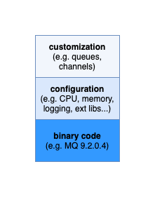

# gityourmq-01

This repository is the first in a set of tutorials that shows you the benefits
of managing your IBM MQ queue manager using DevOps on the Kubernetes platform.
It assumes no knowledge of DevOps or Kubernetes. The tutorial does assume that you have a basic knowledge of MQ.

Each tutorial builds on the previous tutorial

This tutorial we learn:

* The structure of a queue manager instance
* Defining queue managers in `git`
* Installing `Minikube` Kubernetes
* Running your `git` defined queue manager in Kubernetes

## Table of Contents

- [gityourmq-01](#gityourmq-01)
  - [Table of Contents](#table-of-contents)
  - [Introduction](#introduction)
  - [Queue manager as code](#queue-manager-as-code)

## Introduction

To create an instance of a queue manager, we must first install some binary code
provided by IBM. We can then use the `crtmqm` command (with its associated
`qm.ini` file) to create an instance of a queue manager. Once created, we can
connect to this queue manager using the `runmqsc` CLI, and customize it with the
queues, channels and other MQ artefacts required by connected applications.

We can represent a queue manager instance like this:

|  |
|:--:|
| <b> The structure of a queue manager instance</b>|


## Queue manager as code

Let's start by defining this structure of our queue manager in `git`,
specifically GitHub. We'll quickly see the advantages this brings.

To help you get started, fork and clone this [sample
repository](https://github.com/ODOWDAIBM/gityourmq-01), where you can look at it
in your favourite editor. If you're new to GitHub, read about how to use
[fork](https://docs.github.com/en/get-started/quickstart/fork-a-repo) and
[clone](https://docs.github.com/en/get-started/quickstart/fork-a-repo#cloning-your-forked-repository).

It's popular to clone your git repositories under a common point on your local
file system such as `/git`.

```
export GIT-USER=<Your GitHub userID>
```
```
cd $HOME/git
```
```
git clone https://github.com/$GITUSER/gityourmq-01
```
